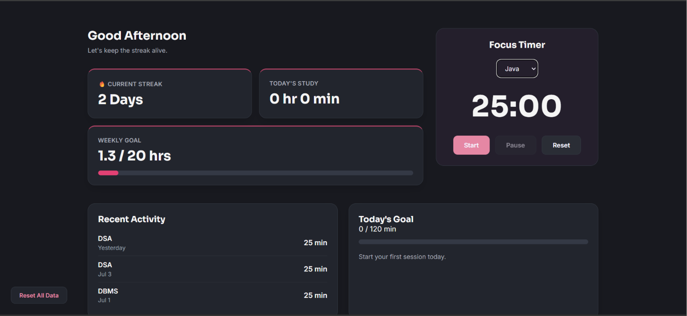
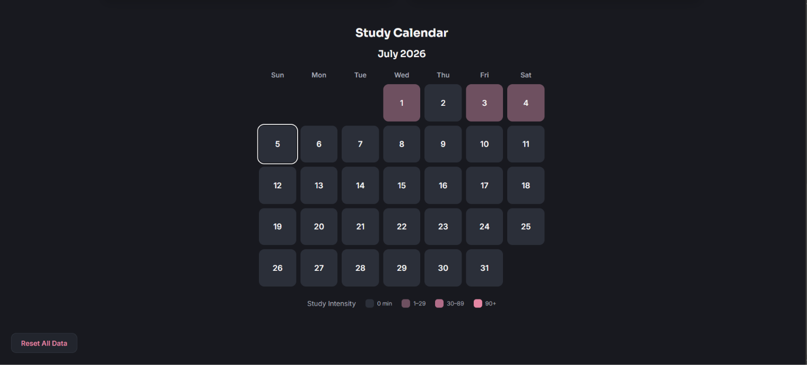

# FocusTrail

A study productivity tracker built with vanilla HTML, CSS, and 
JavaScript, featuring a Pomodoro timer, streak tracking, goal 
progress, and a study calendar.

## Screenshots




## Features

- 25-minute Pomodoro focus timer with subject selection
- Consecutive day streak tracking
- Daily and weekly goal progress bars
- Monthly study calendar with intensity heatmap
- Recent study activity log
- Data stored locally using localStorage
- Responsive layout

## Folder Structure

```
FocusTrail/
├── CSS/
│   ├── style.css
│   ├── dashboard.css
│   ├── timer.css
│   └── heatmap.css
├── JS/
│   ├── storage.js
│   ├── timer.js
│   ├── dashboard.js
│   ├── recentSession.js
│   ├── heatmap.js
│   └── reset.js
├── Screenshots/
│   ├── dashboard.png
│   └── calendar.png
├── README.md
└── index.html
```

## Running Locally

git clone https://github.com/Avanija-cell/focustrail.git

Open index.html in your browser.